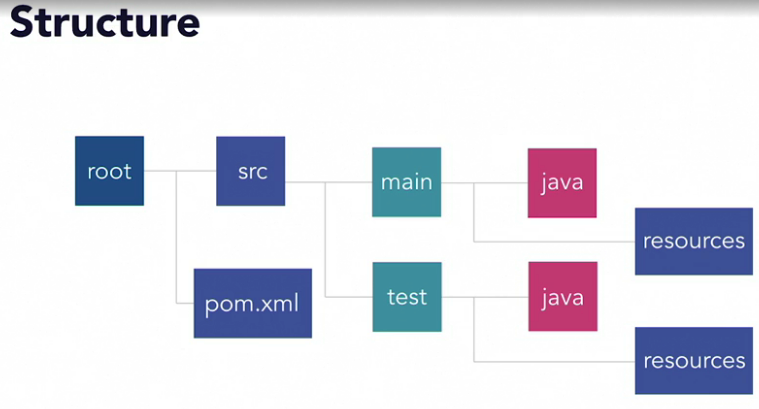

## Maven project structure



## POM (Project Object Model) file sections
- properties
```
  <properties>
    <my.props>11111</my.props>
  </properties>


  ${my.props}
```

- dependencies
```
  <dependencies>
    <scope></scope>
  </dependencies>
```
Complie is the default scope


- build
plugin is similar to devendency, 

```
  <build>
    <plugin>
    </plugin>
  </build>
```

for example
```
<plugin>
    <groupId>org.apache.maven.plugins</groupId>
    <artifactId>maven-surefire-plugin</artifactId>=
    <version> 3.0.0-M4</version>
</plugin>
```
maven-surefire-plugin is plugin for tesing and report

- reporting
for example
```
  <reporting>
      <plugins>
          <plugin>
              <groupId>org.apache.maven.plugins</groupId>
              <artifactId>maven-surefire-report-plugin</artifactId>
              <version>3.0.0-M3</version>
          </plugin>
      </plugins>
  </reporting>
```

create html report under /target/site
```
  mvn clean package site
```

## Parent Pom and Reactors
provid versioned dependencies and plugins

A reactor is used to build a group of related projects.
Maven commands are executed on the parent, and the reactor executes the command on each module.


## Archetype
Archetype is project template using Maven.
You can create project, maven can budil project structure based on the template.
Team can have consistent stardards, project structure, processing.


